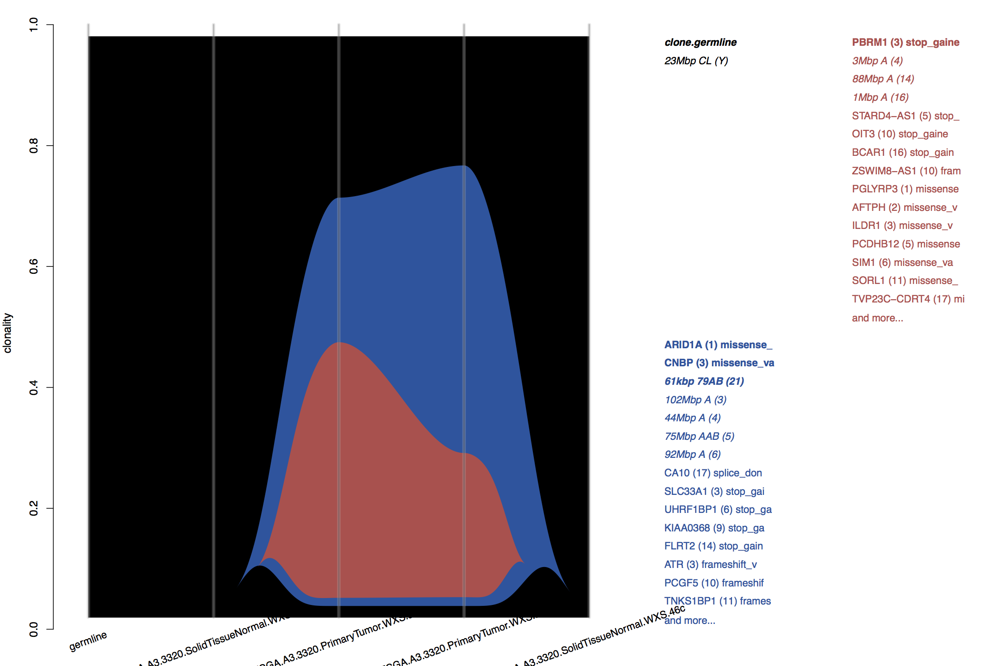

preprint: https://www.biorxiv.org/content/early/2018/07/30/380097

# superFreq
SuperFreq is an R package that analyses cancer exomes.



# What does it do?
SuperFreq analyses and filters somatic SNVs and short indels, calls copy numbers and tracks clones over multiple samples from the same individual. It identifies the copy number alterations and point mutations in each clone, and highlights potentially causing mutations through variant annotation and COSMIC.


# How do I run it?
Start R

```R
#first install superFreq if running first time
#load devtools that allows installation from github (may need to install devtools first with install.packages("devtools"))
library(devtools)

#there has been conflicts between install_github and bioconductor in different version
#so safer to manually install bioconductor dependencies first.
source("https://bioconductor.org/biocLite.R")
biocLite("GenomeInfoDb")
biocLite("GenomicFeatures")
biocLite("VariantAnnotation")

#then install superFreq
install_github('ChristofferFlensburg/superFreq')

#load and test superFreq
library(superFreq)
?superFreq
```

A typical analysis first sets the parameters and then calls the `superFreq()` function.

```R
library(superFreq)

#maximum number of threads.
cpus=6

#this is the meta data input. See ?superFreq for how to set it up.
metaDataFile = 'metaData.tsv'

#an bed file with the capture regions of the exome.
captureRegionsFile = '~/resources/captureRegions/myCaptureInThisBatch.bed'
#if left empty (which is the default), then superFreq uses the ensembl exons for the specified genome assembly.
captureRegionsFile = ''

#This directory with (links to) the reference normals needs to be created and set up. See ?superFreq
normalDirectory = '~/resources/superFreq/referenceNormals/myCaptureInThisBatch'

#The reference fasta and name. Only hg19, hg38 and mm10 available atm.
reference = '~/resources/reference/hg19/hg19.fa'
genome = 'hg19'

#the resource directory with preprocessed data from dbSNP, ExAC, COSMIC, gene annotation and ClinVar.
#Will be created and resources downlaoded from the WEHI server. If you point to an existing resource directory
#then it'll be reused, and resources won't have to be redownloaded and duplicated.
resourceDirectory = "superFreqResources"

#The directory where the log file and saved .Rdata is stored. Will be created.
Rdirectory = 'R'
#The directory where all the plots and tables from the analysis go. Will be created.
plotDirectory = 'plots'

#superFreq reuses saved data if available. This setting can force it to redo part of the analysis.
#default forceRedoNothing() means that saved information is used whenever available.
#forceRedoEverything() ignores any saved data from this batch and overwrites any previous results and plots.
forceRedo = forceRedoNothing()

#a measure on how much large-scale biases are expected in the coverage.
#this controls the sensitivity vs accuracy of the coverage part of copy number calls.
systematicVariance=0.02
#a measure on how much biases (such as PCR duplication) is expected in the VAFs.
#this controls the sensitivity vs accuracy of the heterozygous SNP part of copy number calls.
maxCov=150

#The format of the quality scores of the base calls. Almost always 33 these days.
BQoffset = 33

#The mode. Default 'exome' is for exomes, while 'RNA' has some minor changes when running on RNA.
#There is also a "genome" mode for genomes although it is still being developed and can be very slow.
mode = 'exome'

#This setting runs each individual separately (as indicated in the metadata).
#will create subdirectories in the plotDirectory and Rdirectory.
#This is suggested whenever there is more than one individual in the batch.
splitRun = T

#this performs the actual analysis. output goes to Rdirectory and plotDirectory.
#runtime is typically less than 6 hours at 4 cpus for a cancer-normal exome, but can vary significantly depending on input.
#For a typical cancer-normal exome, 5-10GB of memory is used per cpus, but again, can vary significantly depending on input.
#later runs typically a bit faster as the setup and part of the analysis on the reference normals can be reused.
data =
    superFreq(metaDataFile, captureRegions=captureRegionsFile, normalDirectory=normalDirectory,
              Rdirectory=Rdirectory, plotDirectory=plotDirectory, reference=reference, genome=genome,
              BQoffset=BQoffset, cpus=cpus, forceRedo=forceRedo, systematicVariance=systematicVariance,
              maxCov=maxCov, mode=mode, splitRun=splitRun, resourceDirectory=resourceDirectory)
```

The most convenient way to set this up is to create a runSuperFreq.R file with the above code, and then run it from a [screen](https://en.wikipedia.org/wiki/GNU_Screen) with

```
Rscript runSuperFreq.R
```

Currently in development (please help if you can!), you can generate a .html to explore the data by adding this line after the superFreq() call. Currently no more than a draft.

``` R
printHTML(metaDataFile=metaDataFile, outputFile=paste0(plotDirectory, '/superFreq.html'))
```


More information is in the manual. 


# What is the input?
You need the aligned bam files of the exomes, and a preliminary (liberal) variant calling through for example varScan, mutect, multiSNV or any other similar software. superFreq is not sensitive to false positives in these VCFs. The details of this doesn't affect output much as long as all the somatic and germline variants are present. In house we typically use samtools and varscan:

```
samtools mpileup -d 1000 -q 15 -Q 15 -A -f reference/theAlignedToReference.fa  bam/mySample.bam | varscan mpileup2cns - --variants --strand-filter 0 --p-value 0.01 --min-var-freq 0.02 > vcf/mySample.vcf
```

SuperFreq also requires a set of (at least 2, 5+ is better) reference normal samples from the same sequencing technology and exome capture.
Preferably sequenced in the same lab. These samples do not have to be related to the analysed cancer exomes.

You also need some meta data:
- the fasta file you aligned to
- a tab separated file with information about the samples


# What is the output?
Plots (some shown here), tables, and R objects for downstream analysis. Analysis results as well as diagnostic quality control. Some examples:
- Scatter plots of variant frequencies between pairs of samples
- heatmaps of somatic variant frequencies
- CNA plots for each samples
- river plots showing clonal evolution
- summary plots showing SNVs and CNAs over all samples
- top tables of annotated somatic variants.

# dependencies
- R.
- a bunch of R packages.
- samtools 1.x

# Acknowledgements
We wish to thanks all the organisations sharing data and resources openly, which allows preprocessing and redistribution. This allows superFreq to depend on only a single connection (which is the WEHI servers atm) and a minimum amount of data downloaded. So this limits the risk of 'server X could not be found' type of errors, and it limits the download size of the preprocessed data to hundreds of MBs, rather than hundreds of GBs for the unprocessed original data. It also saves time for everyone by removing user parsing of external resources from the analysis.
- dbSNP
- COSMIC
- ExAC
- ClinVar through NCBI
- Ensembl
- UCSC
