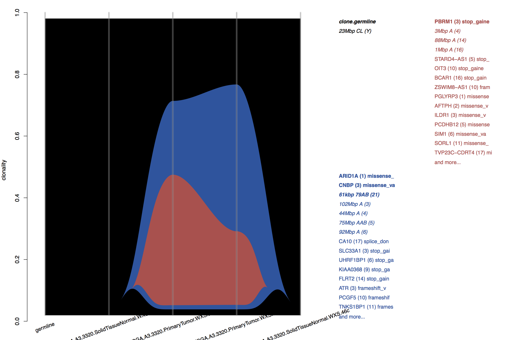
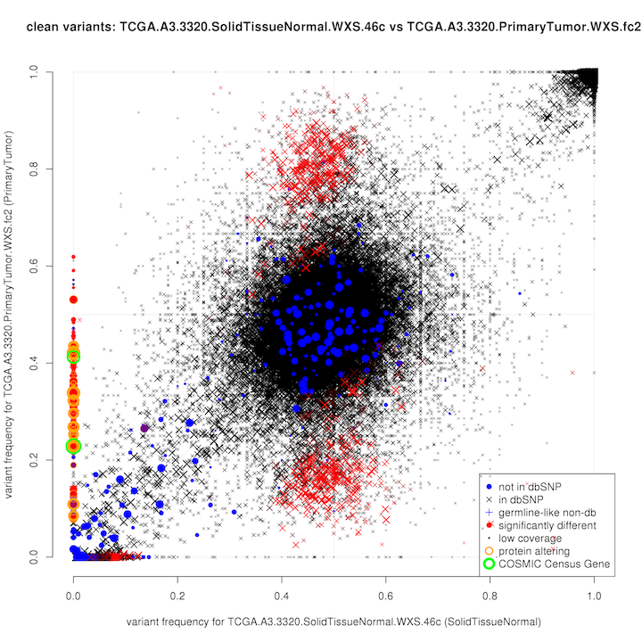
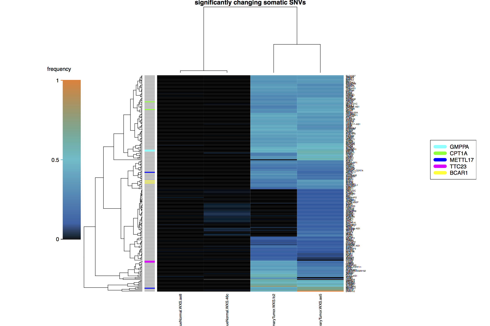
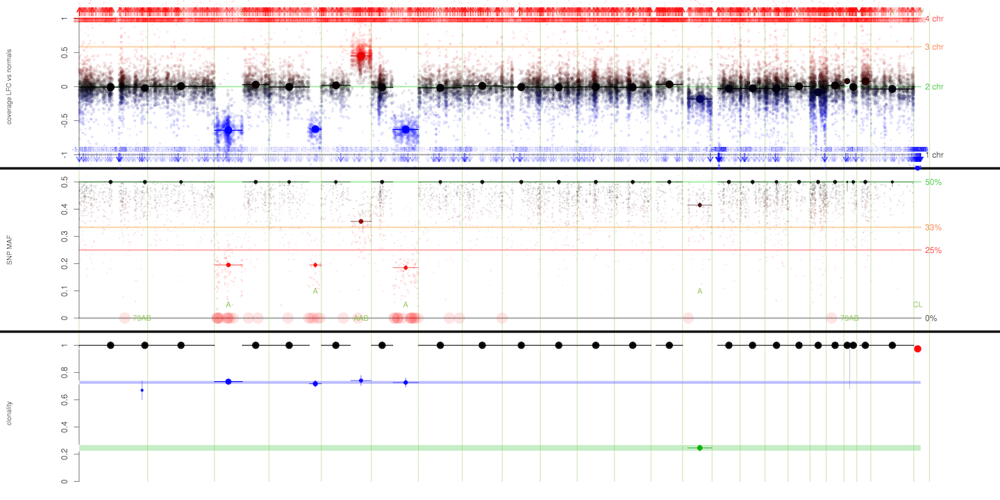

# External resources

Plos Computational Biology: https://journals.plos.org/ploscompbiol/article?id=10.1371/journal.pcbi.1007603

Preprint on RNA-Seq CNAs: https://www.biorxiv.org/content/10.1101/2020.05.31.126888v1

Seminar about superFreq: https://www.youtube.com/watch?v=2RrQirJ7IAk

# superFreq
SuperFreq is an R package that analyses cancer exomes.



# What does it do?
SuperFreq analyses and filters somatic SNVs and short indels, calls copy numbers and tracks clones over multiple samples from the same individual. It identifies the copy number alterations and point mutations in each clone, and highlights potentially causing mutations through variant annotation and COSMIC.




# How do I run it?
Start R

```R
#first install superFreq if running first time
#load devtools that allows installation from github (may need to install devtools first with install.packages("devtools"))
library(devtools)

#there are sometimes conflicts between the github install and bioconductor in different version
#so safer to manually install bioconductor dependencies.
if (!requireNamespace("BiocManager", quietly = TRUE))
    install.packages("BiocManager")
BiocManager::install()
BiocManager::install("GenomeInfoDb")
BiocManager::install("GenomicFeatures")
BiocManager::install("VariantAnnotation")

#then install superFreq
install_github('ChristofferFlensburg/superFreq')

#load and test superFreq
library(superFreq)
?superFreq
```

A typical analysis first sets the parameters and then calls the `superFreq()` function.

```R
library(superFreq)

#maximum number of threads. Limited speed up above ~5 cpus for exomes and RNA-Seq and ~10-20 for genomes.
#Better to parallelise across individuals for cohorts, see the cohort section in the github README.
cpus=4

#this is the meta data input. See ?superFreq for how to set it up.
metaDataFile = 'metaData.tsv'

#This directory with (links to) the reference normals needs to be created and set up. See ?superFreq
normalDirectory = '~/resources/superFreq/referenceNormals/myCaptureInThisBatch'

#The reference fasta and name. Only hg19, hg38 and mm10 available atm.
reference = '~/resources/reference/hg19/hg19.fa'
genome = 'hg19'

#The directory where the log file and saved .Rdata is stored. Will be created.
Rdirectory = 'R'
#The directory where all the plots and tables from the analysis go. Will be created.
plotDirectory = 'plots'

#The mode. Default 'exome' is for exomes, while 'RNA' has some minor changes when running on RNA.
#There is also a "genome" mode for genomes: ~24h for cancer-normal at 10 cpus, 200GB memory.
mode = 'exome'

#this performs the actual analysis. output goes to Rdirectory and plotDirectory.
#runtime is typically less than 6 hours at 4 cpus for a cancer-normal exome, but can vary significantly depending on input.
#For a typical cancer-normal exome, 5-10GB of memory is used per cpus, but again, can vary significantly depending on input.
#later runs typically a bit faster as the setup and part of the analysis on the reference normals can be reused.
data =
    superFreq(metaDataFile, normalDirectory=normalDirectory,
              Rdirectory=Rdirectory, plotDirectory=plotDirectory, reference=reference, genome=genome,
              cpus=cpus, mode=mode)
```

The most convenient way to set this up for one or a few individuals is to create a runSuperFreq.R file with the above code, and then run it from a [screen](https://en.wikipedia.org/wiki/GNU_Screen) with

```
Rscript runSuperFreq.R
```
Scroll down to the cohort section for analysing a larger number of individuals on an HPC.

# A note on version of superFreq, R, bioconductor and samtools
SuperFreq version 1.3.2 (there's a release) is tested and works on R v.3.6.0 and samtools 1.9. There is a known conflict between superFreq 1.3.2 and earlier with samtools 1.10, due to change in column order of samtools mpileup. This is adress in 1.4.0, that should be compatible with R 4.0.0 and corresponding bioconductor release, as well as all 1.X version of samtools.



# What is the input?
You need the aligned bam files of the exomes, and a preliminary (liberal) variant calling through for example varScan, mutect, multiSNV or any other similar software. superFreq is not sensitive to false positives in these VCFs. The details of this doesn't affect output much as long as all the somatic and germline variants are present. In house we typically use samtools and varscan:

```
samtools mpileup -d 1000 -q 15 -Q 15 -A -f reference/theAlignedToReference.fa  bam/mySample.bam | varscan mpileup2cns - --variants --strand-filter 0 --p-value 0.01 --min-var-freq 0.02 --output-vcf 1 > vcf/mySample.vcf
```

From version 1.3.0, superFreq will automatically run this command in case the .vcf files linked in the meta data are missing. Note that this requires both `samtools` and `varscan` to be available in the system environment in which the superFreq R session is running.

SuperFreq also requires a set of (at least 2, 5+ is better) reference normal samples from the same sequencing technology and exome capture.
Preferably sequenced in the same lab. These samples do not have to be related to the analysed cancer exomes.

You also need some meta data:
- the fasta file you aligned to
- a tab separated file with information about the samples



# What is the output?
Plots (some shown here), tables, and R objects for downstream analysis. Analysis results as well as diagnostic quality control. Some examples:
- Scatter plots of variant frequencies between pairs of samples
- heatmaps of somatic variant frequencies
- CNA plots for each samples
- river plots showing clonal evolution
- summary plots showing SNVs and CNAs over all samples
- top tables of annotated somatic variants.

# dependencies
- R.
- a bunch of R packages.
- samtools 1.x

# Resource usage
Most of the heavy calculation stages of superFreq (such as the variant calling) are parallelised over `cpus` threads, and runtime should scale close to linearly for small numbers of cpus. However, some parts of the analysis requires use of all the data together and is difficult to efficiently parallelise, which will bottleneck runtime for high `cpus`. Further, while the R parallel package that manages threading in theory does "copy on write", the interaction with the R garbage collection in practice makes memory usage increase almost linearly with `cpus`. With this in mind, recommended `cpus` for version 1.3.2 are:

- RNA-Seq: 2-4 cpus (~2h runtime, ~10GB memory per cpu typically enough)
- exome: 4-6 cpus (~3h runtime, ~15GB memory per cpu typically enough)
- genome: 10-20 cpus (~24h runtime, ~20GB memory per cpu typically enough)

Runtime and memory usage are for a cancer-normal pair with typical read depths. Memory and runtime use increases with number of studied samples, and runtime increases with read depth (memory shouldn't be affected too much). Runtime can be decreased further by increasing cpus, but expect limited gain above 2x recommended cpus.

Runtime and memory usage also scales with the number of preliminary variant calls in the input VCF, so another way to decrease resourse usage is to restrict parameters in the varscan call above (such as increasing minimum VAF up to 5%, at the cost of potentially losing low VAF variants).

# Tips to decrease memory use
SuperFreq can use a lot of memory, in particular when running genomes. This is in part due to copy-on-write when parallelising fails when garbage collection is triggered, as the garbage collectors touches all objects and triggers copy-on-write.

The memory scales roughly:

- linearly with cpus
- linearly with the total number of unique positions in the vcf input
- linearly with number of samples, from the individual plus the reference normal samples

So options to limit memory use are:

- Decreasing cpus

- Limit number of reference normals. Genomes are typically much cleaner and less variable than exomes, so fewer references are fine. I think 3 is plenty unless there are batch effects or QC issues, and running on the minimum allowed of 2 works fine for our test data. For exomes, going down to 5 should be fine in most cases, or down to 3 if you have clean data without too much batch effects.

- Pre-filter the input VCF files. Variants supported by 2 or fewer reads are unlikely to be very interesting for example, and might remove a lot of noise variants without having them read into R memory. Or whatever settings are available from the preliminary caller.


# Cohort analysis (on HPC)
When analysing more than a few individuals, the fastest way to get the analysis through is to parallelise across individuals, potentially across separate jobs if in an HPC environment. There are many ways to do this, but the key is the `participant` setting in the `superFreq()` call, which restricts the analysis to only one individual in the meta data, and allows you to submit parallel `superFreq()` calls for different individuals. We are on a torquelord system, and submit jobs through a bash file that takes individual and number of threads to analyse as input.

```
module load R
module load samtools

R --file=runSuperFreqOnDonor.R --args $1 $2
```
with the `runSuperFreqOnDonor.R` file:
``` R
library(superFreq)

#take the INDIVIDUAL and cpu as input.
participant = as.character(commandArgs(TRUE)[1])
cpus = as.numeric(commandArgs(TRUE)[2])

superFreq(
          metaDataFile = 'metaData.tsv',  #all individuals in one metaData file.
          genome='hg38',
          normalDirectory='/path/to/my/reference/normals',
          Rdirectory='/path/to/R',
          plotDirectory='/path/to/plots',  #each individual will get a subdirectory in here
          reference='/path/to/my/reference/genome/hg38.fa',
          mode='genome',
          cpus=cpus,
          participants=participant  #run only on this individual
          )
```

When analysing multiple indivuduals, there are cohort-level analysis and visualisation tools available, wrapped into the function `superFreq::runSummaryPostAnalysis`. After all the superFreq runs have finished for the individuals, you can run the cohort analysis with:

``` R
runSummaryPostAnalysis(metaDataFile='metaData.tsv',
           Rdirectory='/path/to/R',
           plotDirectory='/path/to/plots',
           cpus=4,
           genome='hg38')
```

The output will be in `/path/to/plots/cohortWide`. Some of the output is focused on a shortlist of Genes of Interest (GoI) that can be given as argument (`runSummaryPostAnalysis(..., GoI=c('TP53', 'KRAS', 'NRAS'))`), or it will otherwise be set from frequently altered genes in the samples, filtered against COSMIC and ClinVar.

Varikondo developed at https://github.com/annaquaglieri16/varikondo is an R package that provides interactive visualisation of output from superFreq and other variant callers over a subset of Genes of Interest.

# Acknowledgements
We wish to thanks all the organisations sharing data and resources openly, which allows preprocessing and redistribution. This allows superFreq to depend on only a single connection (which is the WEHI servers atm) and a minimum amount of data downloaded. So this limits the risk of 'server X could not be found' type of errors, and it limits the download size of the preprocessed data to hundreds of MBs, rather than hundreds of GBs for the unprocessed original data. It also saves time for everyone by removing user parsing of external resources from the analysis.
- dbSNP
- COSMIC
- ExAC
- ClinVar through NCBI
- Ensembl
- UCSC
